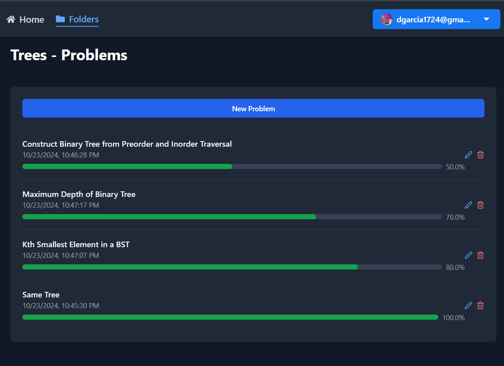
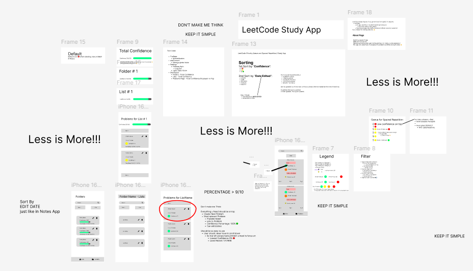
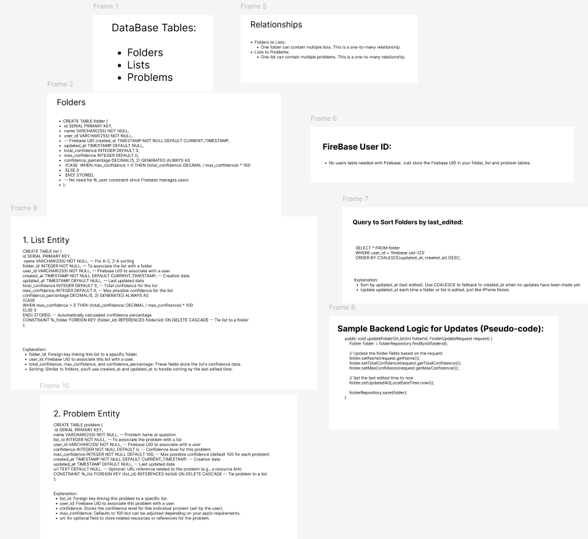

### Live Site
[https://leetcode-spaced-repetition-study-app.netlify.app/](https://leetcode-spaced-repetition-study-app.netlify.app/)

# Project Overview

This study app leverages spaced repetition to help users organize their folders, lists, and problems while tracking confidence levels. Items with lower confidence scores are prioritized, and if there’s a tie, they are sorted by the least recently edited, ensuring users focus on their most relevant study materials.

Users can securely authenticate with email/password or Google accounts, enabling personalized data management. The app also features a light/dark mode toggle, enhancing the user experience and providing a comfortable studying environment.

## Technologies Used

- **Frontend:** React, Vite, Tailwind CSS (for responsive UI and theming), React Query (data fetching)
- **Backend:** Spring Boot, PostgreSQL (data management)
- **Authentication:** Firebase (email/password, Google)
- **Other:** Firebase Firestore, Toast notifications (for user feedback)

This app combines simplicity with efficient data organization, providing a clean, intuitive interface for study management.

## Design Tools

- **Figma:** The User Interface of the app was designed using Figma, allowing for an intuitive user experience and responsive layouts. Additionally, the database schema was crafted in Figma to ensure a clear and efficient data structure, facilitating smooth backend integration.

